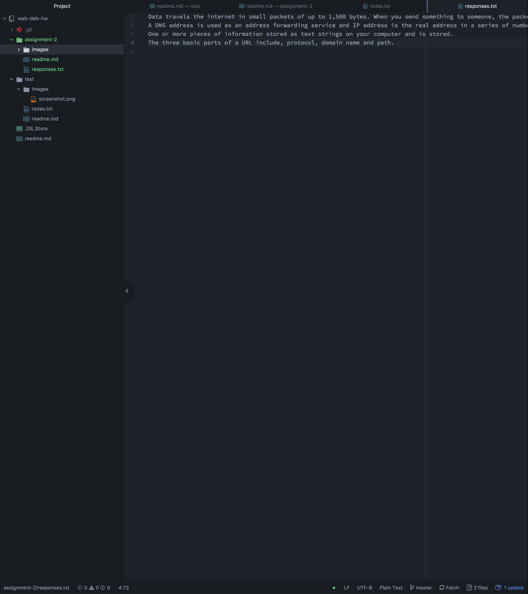

<h1>Technical Report<h1>

A Version Control system is used to keep records of a file so that you can recall specific version for later. It is a way to go back to any version of your project, depending on where you need to go.

